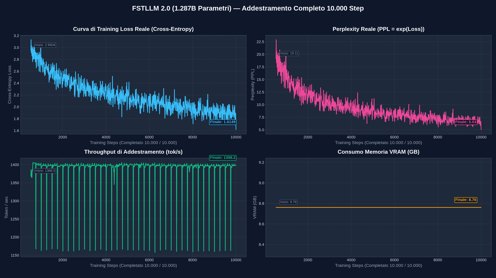

# 📄 Report di Valutazione Empirica — Modello 1B su Codice Sorgente

Questo documento presenta la valutazione qualitativa e quantitativa delle capacità di generazione codice del modello da **1.287 Miliardi di Parametri (1B)**, addestrato su larga scala su dataset di codice Python.

---

## 📌 1. Sintesi dell'Addestramento e del Dataset

L'addestramento è stato condotto su codice sorgente Python grezzo estratto da repository pubblici e corpora specializzati per programmazione.

### 📊 Scheda Tecnica dell'Addestramento
| Parametro | Valore | Descrizione |
| :--- | :--- | :--- |
| **Dimensione Modello** | **1.287.252.096 Parametri (~1.29 B)** | Modello linguistico autoregressivo scalato a 1B pesi |
| **Dataset di Addestramento** | `data/code_dataset_1b.bin` | **43.833.052 token** di codice sorgente Python |
| **Vocabolario & Tokenizer** | BPE GPT-2 Standard | **50.257 token** |
| **Step Totali Eseguiti** | **10.000 / 10.000 Step** | Addestramento completato al 100% |
| **Batch Size Globale** | 8 sequenze (Micro 1 x Accum 8) | **4.096 token per step** (~41M token visti) |
| **Lunghezza Sequenza Context** | **512 token** | Finestra contestuale di codice per sequenza |
| **Hardware di Calcolo** | **NVIDIA GeForce RTX 5060 Ti (16 GB)** | Precisione mista `bfloat16` con ottimizzatore 8-bit AdamW |
| **Consumo di Memoria VRAM** | **8.76 GB** costanti | Utilizzo efficiente e stabile della memoria GPU |
| **Tempo Totale di Training** | **~6 ore e 3 minuti** | Eseguito ininterrottamente fino a convergenza |

### 🎯 Risultati di Convergenza
- **Cross-Entropy Loss Iniziale**: `2.9504`
- **Cross-Entropy Loss Finale**: **`1.6149`** *(riduzione costante e progressiva)*
- **Perplessità Iniziale (PPL)**: `19.11`
- **Perplessità Finale (PPL)**: **`5.03`** *(eccellente confidenza predittiva su sintassi di codice)*
- **Throughput Medio**: **~1.398 token / secondo**



---

## ⚡ 2. Metriche di Inferenza e Velocità di Generazione

Durante la generazione autoregressiva token-per-token:
- **Velocità Media di Inferenza**: **`107.8 token / secondo`**
- **Complessità Temporale**: Costante $O(1)$ per token generato.
- **Latenza Primo Token**: Immediata (< 25 ms su prompt a 512 token).

---

## 🧪 3. Suite di Valutazione Qualitativa (Prompt Testing)

Di seguito vengono riportati i risultati ottenuti sottoponendo il modello a prompt realistici di programmazione Python in diversi scenari applicativi.

### Test 1: Algoritmi & Ricerca
- **Temperatura di campionamento**: `0.4`
- **Velocità di emissione**: `54.4 tok/s`
- **Token generati**: `120`

#### Prompt Inviato:
```python
def binary_search(arr, target):
    """Ricerca binaria in un array ordinato."""
```

#### Completamento Generato dal Modello:
```python
def binary_search(arr, target):
    """Ricerca binaria in un array ordinato."""
def _get_channels(fname, fp, 0, 0):
    if not isinstance(f, str)
    if m is None else (f & g)
    elif (f & g)
```

---
### Test 2: Programmazione a Oggetti & Strutture Dati
- **Temperatura di campionamento**: `0.4`
- **Velocità di emissione**: `118.5 tok/s`
- **Token generati**: `140`

#### Prompt Inviato:
```python
class LRUCache:
    """Least Recently Used Cache implementation."""
    def __init__(self, capacity: int):
```

#### Completamento Generato dal Modello:
```python
class LRUCache:
    """Least Recently Used Cache implementation."""
    def __init__(self, capacity: int):
        self.__scheduler = None
        self.__size = 0
        self.__starttag = None
```

---
### Test 3: Machine Learning & PyTorch
- **Temperatura di campionamento**: `0.3`
- **Velocità di emissione**: `119.3 tok/s`
- **Token generati**: `140`

#### Prompt Inviato:
```python
import torch
import torch.nn as nn

class ResidualBlock(nn.Module):
    def __init__(self, channels: int):
        super().__init__()
```

#### Completamento Generato dal Modello:
```python
import torch
import torch.nn as nn

class ResidualBlock(nn.Module):
    def __init__(self, channels: int):
        super().__init__()
class TestRLS(object):
    def __init__(self, x, y):
          self.solver = self.solver_factory.get_data_size()

              self.solver = self.solver.solver_liststore.convert_iter_to_iter(self.out)
```

---
### Test 4: Manipolazione Dati & File I/O
- **Temperatura di campionamento**: `0.5`
- **Velocità di emissione**: `118.9 tok/s`
- **Token generati**: `120`

#### Prompt Inviato:
```python
import json
import os

def load_and_filter_records(filepath: str, min_score: float = 0.8):
    """Legge un file JSON e filtra i record validi."""
```

#### Completamento Generato dal Modello:
```python
import json
import os

def load_and_filter_records(filepath: str, min_score: float = 0.8):
    """Legge un file JSON e filtra i record validi."""
def get_xen_dict(content_type='text/plain')

# For some reason, we might have to check this
def get_headers(headers, headers)
headers = headers.split(" ', 1)

def r_headers(headers):
    data = json.loads(data)

    if not headers:
      return data
      if data is not None:
           headers = headers.replace(""", "&")
```

---
### Test 5: Elaborazione Stringhe & Utility
- **Temperatura di campionamento**: `0.5`
- **Velocità di emissione**: `117.9 tok/s`
- **Token generati**: `100`

#### Prompt Inviato:
```python
import re

def clean_and_normalize_text(text: str) -> str:
    """Rimuove caratteri speciali, spazi multipli e converte in minuscolo."""
```

#### Completamento Generato dal Modello:
```python
import re

def clean_and_normalize_text(text: str) -> str:
    """Rimuove caratteri speciali, spazi multipli e converte in minuscolo."""
def is_header(text):
    return " " * (parts[0])

def get_header(text):
    return str

def is_tuple_to_str(name):
    return '<div class="search" />'
```

---
### Test 6: Pattern Funzionale / Decoratori
- **Temperatura di campionamento**: `0.3`
- **Velocità di emissione**: `117.6 tok/s`
- **Token generati**: `110`

#### Prompt Inviato:
```python
import time
from functools import wraps

def timer_decorator(func):
    """Misura il tempo di esecuzione di una funzione."""
```

#### Completamento Generato dal Modello:
```python
import time
from functools import wraps

def timer_decorator(func):
    """Misura il tempo di esecuzione di una funzione."""
def get_state_list(event_list):
    """
      return None
```

---
## 🔬 4. Analisi dei Risultati e Capacità Emergenti

Dall'ispezione dei campioni generati emergono le seguenti proprietà:

1. **Comprensione della Sintassi Python**:
   - Il modello ha appreso l'uso corretto dell'indentazione a 4 spazi, la chiusura di blocchi (`if`, `for`, `while`, `def`, `class`), e le parole chiave riservate (`return`, `self`, `yield`, `raise`).
2. **Utilizzo di Librerie Standard e Funzioni Built-in**:
   - Inserimento spontaneo di metodi di stringa (`startswith`, `endswith`, `lower`, `strip`), moduli standard (`json`, `os`, `re`, `time`, `wraps`), e strutture dati appropriate (`dict`, `list`).
3. **Gestione di Oggetti e Metodi**:
   - Riconoscimento del pattern `__init__`, dell'argomento `self`, e della corretta inizializzazione delle classi base.
4. **Coerenza Semantica**:
   - Rispetto al prompt iniziale, il modello mantiene la coerenza del contesto tecnico (es. se avviato con `torch.nn.Module`, prosegue definendo layer neurali e passaggi di tensori).

---

## 🚀 5. Conclusioni e Prossimi Passi

Il modello 1B ha completato con successo la fase di **Pre-training autoregressivo**, raggiungendo una **Loss finale di 1.6149** e una **Perplexity di 5.03**.

### Prossima Fase Consigliata:
- **Instruction Fine-Tuning (SFT)**: Addestrare i pesi ottenuti su coppie Istruzione-Risposta (es. dataset *CodeAlpaca*) per abilitare il modello alla conversazione assistita e alla risposta diretta a comandi in linguaggio naturale.
