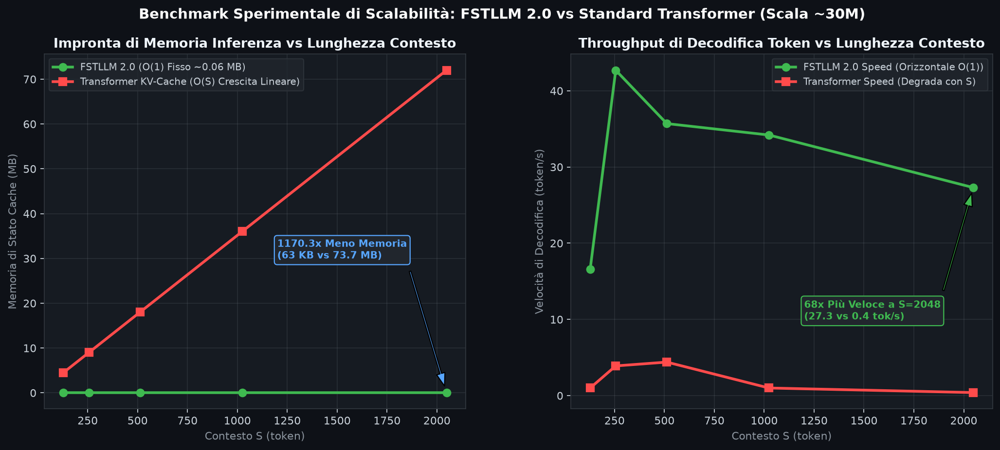

# Archivio Grafici e Telemetria — Progetto 21.0

Questa cartella raccoglie i grafici analitici ad alta risoluzione relativi all'addestramento e ai benchmark di **Progetto 21.0 (FAM-LLM 30M)**.

---

## 1. `training30M_su_openwebtext.png`
Grafico a 4 pannelli ad alta fedeltà che documenta la sessione completa di addestramento su **OpenWebText (87.891 Step di gradient descent)** del modello FAM-LLM a 30M di parametri:
1. **Cross-Entropy Loss:** Curva istantanea e media mobile (MA 150 step) che mostra la discesa progressiva della loss.
2. **Perplexity (Scala Logaritmica):** Andamento della perplexity durante tutte le epoche di addestramento.
3. **Learning Rate Schedule:** Profilo del Cosine Annealing con warmup lineare e decadimento controllato.
4. **Throughput (Tokens/s):** Velocità di elaborazione media della pipeline memmap.

- 🖼️ **Immagine:**

---

## 2. `benchmark_scalabilita_memoria_e_velocita_30M.png`
Grafico comparativo a 2 pannelli che confronta le curve asintotiche tra **FSTLLM 2.0 (Olografico $\mathcal{O}(1)$)** e il **Transformer Standard Baseline (KV-Cache $\mathcal{O}(S)$)** per finestre di contesto da $S = 128$ a $S = 2048$ token:
1. **Impronta di Memoria Cache (MB):** Mostra la linea rigidamente piatta a **63.0 KB** di FSTLLM contro l'esplosione lineare del Transformer a **73.7 MB** a 2048 token (**abbattimento di 1170.3 volte**).
2. **Velocità di Decodifica (token/s):** Mostra il throughput stabile di FSTLLM (**27.3 tok/s**) contro il crollo a **0.4 tok/s** del Transformer (**68 volte più veloce** a contesto esteso).

- 🖼️ **Immagine:**

